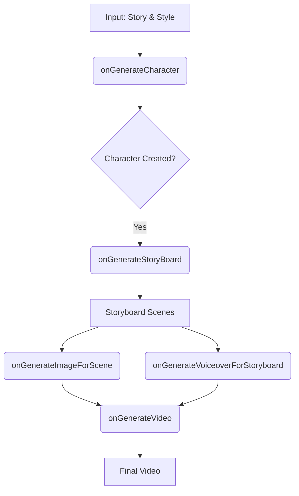

# ShortGenerator Integration Documentation

The `ShortGenerator.tsx` component serves as the primary orchestrator for the AI video creation process. It coordinates multiple flows to transform a simple story into a rich multimedia experience.

## Component Workflow

The creation process follows a logical sequence of AI interactions:

### 1. Script & Style Definition
The user provides a story and selects an art style. The component uses these as foundational inputs for all subsequent steps.

### 2. Character Generation (`onGenerateCharacter`)
- **Action**: Generates a consistent protagonist for the story.
- **Under the hood**: 
  1. Calls `generateCharacterDetails` to get a description.
  2. Calls `generateCharacterImage` to get a visual reference (data URI).
- **Result**: A character profile that is used as a "Reference Image" for all scene illustrations to maintain visual consistency.

### 3. Storyboard Creation (`onGenerateStoryBoard`)
- **Action**: Breaks the story into a sequence of actionable scenes.
- **Under the hood**: Calls `generateScriptStoryboard`.
- **Result**: A list of scenes with specific image prompts, narration text, and motion descriptions.

### 4. Scene Asset Harvesting
For each scene in the storyboard, the user can manually or automatically trigger:
- **Image Generation (`onGenerateImageForScene`)**: Uses the scene's prompt + character reference image + art style + aspect ratio.
- **Voiceover Generation (`onGenerateVoiceoverForStoryboard`)**: Uses the scene's narrator text + selected tone and voice.

### 5. Final Video Assembly (`onGenerateVideo`)
- **Action**: Triggers the backend process to stitch images and audio into a final video file.
- **Result**: A `finalVideoId` used for downloading the result.

## State Management

The component manages the following key states:
- `character`: The protagonist's details and image.
- `storyboard`: The array of `Scene` objects being enriched.
- `aspectRatio`: Global setting for visual format (9:16, 16:9, 1:1).

## AI Orchestration Map

